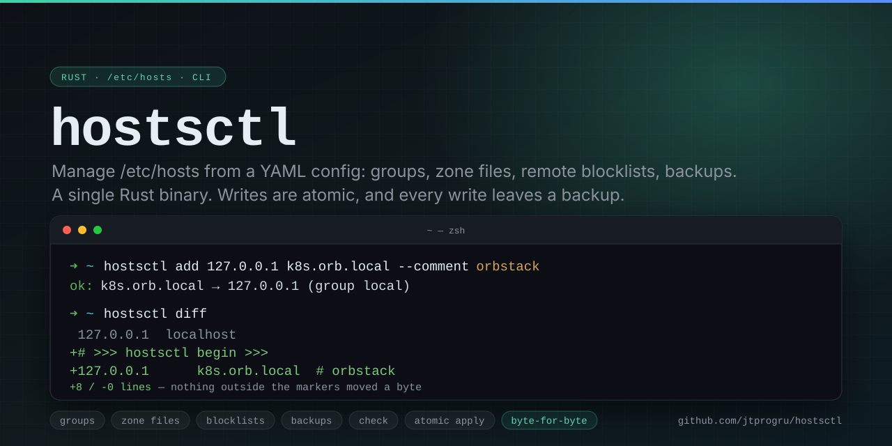

# hostsctl

[](https://github.com/jtprogru/hostsctl/actions/workflows/ci.yml)
[](https://crates.io/crates/hostsctl)
[](https://jtprogru.github.io/hostsctl/ru/)
[](LICENSE)

<p align="center">
  
</p>

Управление `/etc/hosts` из YAML-конфига: группы, файлы-зоны, удалённые блоклисты, бэкапы.

Записи живут в конфиге, hostsctl рендерит их в блок между маркерами внутри `/etc/hosts`.
Всё, что вне маркеров — системные строки, чужие блоки, ручные правки — переносится в новый
файл байт в байт и никогда не удаляется.

English: [README.md](README.md) · Документация: <https://jtprogru.github.io/hostsctl/ru/>

## Установка

```bash
brew install jtprogru/tap/hostsctl
# или
cargo install hostsctl
# или
curl -fsSL https://raw.githubusercontent.com/jtprogru/hostsctl/main/scripts/install.sh | sh
```

Готовые архивы для Linux (glibc и musl, `x86_64` и `aarch64`) и macOS (Apple silicon и
Intel) лежат на [странице релизов](https://github.com/jtprogru/hostsctl/releases) — каждый
с `sha256`, keyless-подписью cosign и SLSA-аттестацией провенанса.

## Тридцать секунд

```bash
hostsctl init                                # ~/.config/hostsctl/config.yaml
hostsctl add 127.0.0.1 k8s.orb.local --comment orbstack
hostsctl diff                                # что изменится; ничего не пишет
sudo hostsctl apply
```

```
127.0.0.1	localhost          ← системные строки, не тронуты
255.255.255.255	broadcasthost

# >>> hostsctl begin >>>
# generated by hostsctl 2026-08-11 17:15
# source: /Users/you/.config/hostsctl/config.yaml — edit that, not this block

# --- local — Local development ---
127.0.0.1      k8s.orb.local  # orbstack
# <<< hostsctl end <<<
```

## Что умеет

- **Группы.** Набор записей, который включается и выключается целиком — выключить
  блоклист на вечер не значит удалить его.
- **Файлы-зоны.** Можно держать всё в одном `config.yaml`, можно разложить по файлам в
  обычном hosts-синтаксисе или в YAML. Правки через CLI уходят обратно в тот файл, откуда
  группа пришла, и в его формате.
- **Удалённые блоклисты.** Список подключается по URL, с `rewrite_ip` и списком
  исключений. Списки кешируются и обновляются с учётом `ETag`; `apply` работает только с
  кешем и в сеть не ходит.
- **Бэкапы.** Снимок перед каждой записью, включая запись при откате.
- **Линтер.** `hostsctl check` показывает то, что `/etc/hosts` молча проигнорирует:
  wildcards, порты в имени хоста, адреса, которые не адреса.

## Что гарантирует

- Всё вне маркеров сохраняется — проверено тестами на копии настоящего `/etc/hosts`.
- Запись атомарная: временный файл, `fsync`, `rename`; права и владелец целевого файла
  сохраняются.
- Результат без `127.0.0.1 localhost` отвергается до того, как что-либо записано.
- Под `sudo` конфиг и кеш всё равно берутся из домашнего каталога того, кто вызвал sudo, а
  созданные под root файлы возвращаются ему во владение. Никаких root-овых файлов в
  `~/.config`.

## Команды

```bash
hostsctl list --all                    # записи, включая выключенные
hostsctl search orb
hostsctl rm sre-mcp.local               # по имени или по адресу
hostsctl disable k8s.orb.local          # остаётся в конфиге, уходит из /etc/hosts
hostsctl status                         # конфиг, блок, группы, бэкапы
sudo hostsctl off                       # убрать блок, конфиг не трогая
sudo hostsctl backup restore

hostsctl group list
hostsctl group add work --file zones/20-work.yaml
hostsctl zone add 'legacy/*.hosts'
hostsctl source add <url> --group ads --rewrite-ip 0.0.0.0 --update
hostsctl completions zsh
```

Полный справочник — <https://jtprogru.github.io/hostsctl/ru/reference/cli/>, то же самое
печатает `hostsctl --help`.

## Требования

Linux или macOS. Сборки под Windows нет: hostsctl построен вокруг `/etc/hosts`, `libc` и
системного сброса DNS-кеша.

Команды, которые пишут в `/etc/hosts`, требуют root; `list`, `diff`, `status`, `check`,
`search` и `source update` — нет. Без прав утилита ничего не обходит: печатает готовую
команду с `sudo` и выходит с кодом `4`.

## Разработка

```bash
make          # все цели
make test     # unit + прогон бинарника по временному hosts
make ci       # то, что гоняет CI: линтеры, тесты, сгенерированные доки, MSRV
```

См. [CONTRIBUTING.md](CONTRIBUTING.md).

## Лицензия

MIT — см. [LICENSE](LICENSE).
